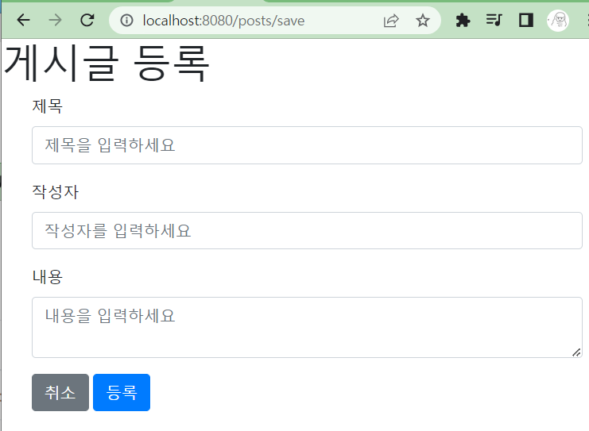
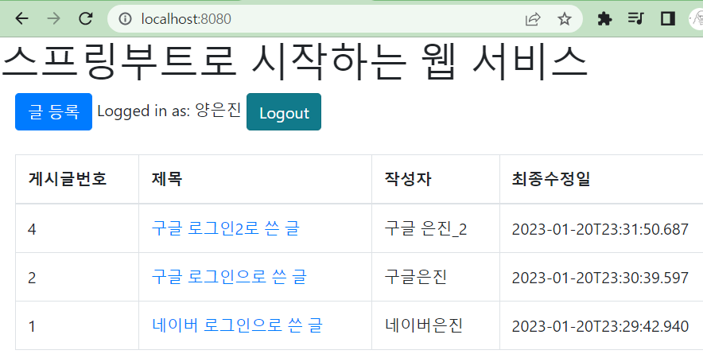
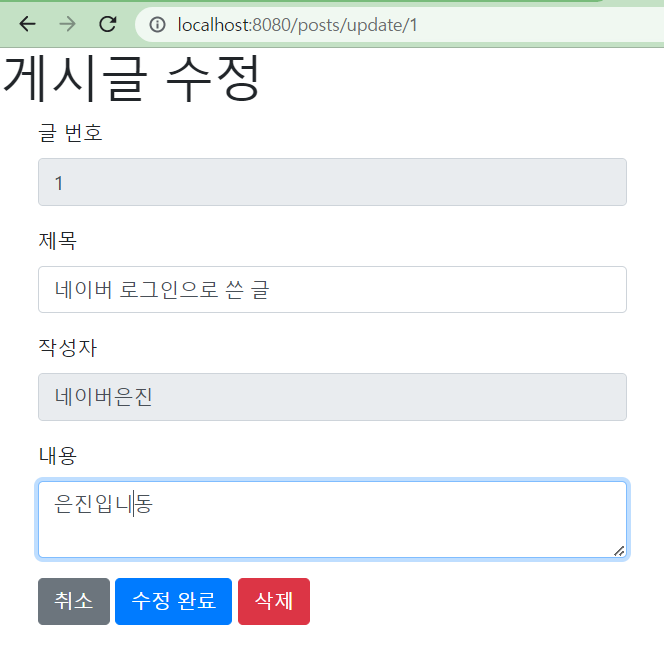
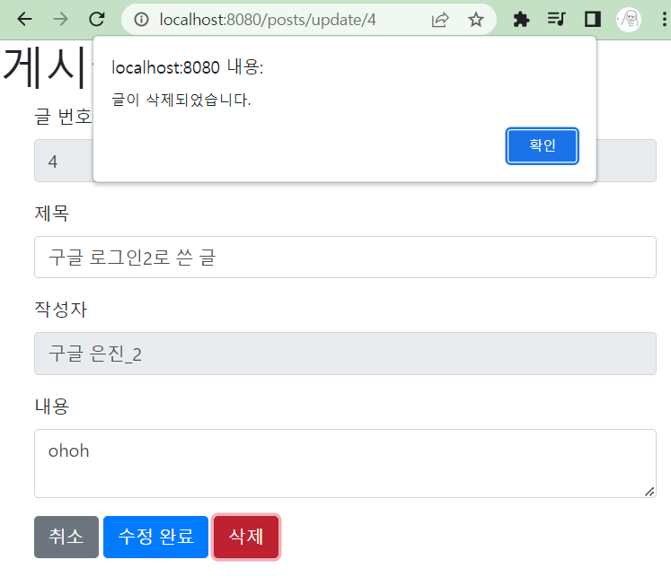
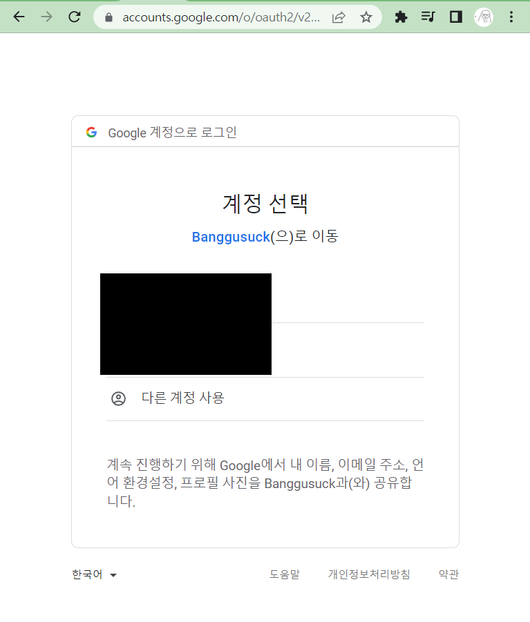
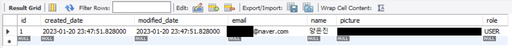

# 스프링 부트와 AWS로 혼자 구현하는 웹 서비스

## 게시판

- 책에서 구현한 내용으로는 게시판에 작성한 글에 모든 사용자가 접근이 가능하여 
  자신의 글만 삭제, 수정이 가능하도록 하는 부분을 추가해야 한다.

- 작성자는 게시글 최초 등록 시에만 작성 가능하고 수정할 수 없다.

  ### 구현 사진

  

  

  

## 로그인

- 파일 업로드 시 항상 client_id, secret_key 등 보안 관련 문제가 생기지 않도록 조심하기
- User 회원가입 시 Role을 GUEST로 설정하고 이를 USER로 바꿔주는 과정을 거쳐 게시판에 접근가능하도록 되어있다.
  - `..\BangGuSuck\src\main\java\com\gusuck\bang\banggusuck\config\auth\dto\OAuthAttributes.java` 에서 `public User toEntity()`의 `.role(Role.GUEST)`를 `.role(Role.USER)`로 바꾸면 회원가입 후 바로 게시글에 접근이 가능하다.

- 구글은 Spring security을 공직 지원해주기 때문에 소셜 로그인 구현이 쉬웠지만, 
  네이버는 따로 공식 지원이 없기 때문에 `..\BangGuSuck\src\main\resources\application-oauth.properties`에서 지정해줘야 하는 부분이 많았다.

- 또, 네이버에서 반환하는 회원 정보는 JSON형태이기 때문에 response로 응답을 받아야 한다.

  ### 구현사진

  

  

  

## 오류해결

- 모든 프로그램 버전을 책에 나온대로 수정해도 TEST가 돌아가지 않아 시간을 많이 썼다.
  - junit4를 build.gradle에 추가해서 해결
  - 저자의 업데이트 코드 참고하여 gradle버전 업그레이드해서 사용 
    https://jojoldu.tistory.com/539 
- 이후 다른 프로젝트에서 사용할 것을 대비하여 버전을 업그레이드해서 사용하는 방법으로 하였다.
